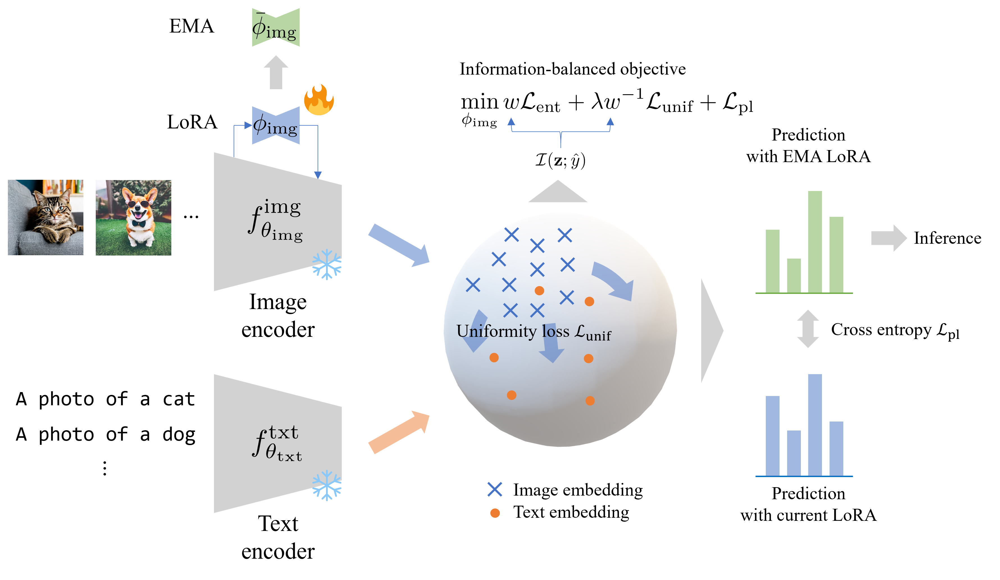

# Uniformity First: Uniformity-aware Test-time Adaptation of Vision-language Models against Image Corruption
The official code for "Uniformity First: Uniformity-aware Test-time Adaptation of Vision-language Models against Image Corruption."  
[[arXiv](https://arxiv.org/abs/2505.12912)]

<details><summary><strong>Abstract</strong></summary>
Pre-trained vision-language models such as contrastive language-image pre-training (CLIP) have demonstrated a remarkable generalizability, which has enabled a wide range of applications represented by zero-shot classification.
However, vision-language models still suffer when they face datasets with large gaps from training ones, i.e., distribution shifts.
We found that CLIP is especially vulnerable to sensor degradation, a type of realistic distribution shift caused by sensor conditions such as weather, light, or noise.
Collecting a new dataset from a test distribution for fine-tuning highly costs since sensor degradation occurs unexpectedly and has a range of variety.
Thus, we investigate test-time adaptation (TTA) of zero-shot classification, which enables on-the-fly adaptation to the test distribution with unlabeled test data.
Existing TTA methods for CLIP mainly focus on modifying image and text embeddings or predictions to address distribution shifts.
Although these methods can adapt to domain shifts, such as fine-grained labels spaces or different renditions in input images, they fail to adapt to distribution shifts caused by sensor degradation.
We found that this is because image embeddings are "corrupted" in terms of <em>uniformity</em>, a measure related to the amount of information.
To make models robust to sensor degradation, we propose a novel method called <strong>un</strong>iformity-aware <strong>info</strong>rmation-balanced TTA (UnInfo).
To address the corruption of image embeddings, we introduce uniformity-aware confidence maximization, information-aware loss balancing, and knowledge distillation from the exponential moving average (EMA) teacher.
The uniformity-aware confidence maximization induces image embeddings to uniformly distribute on the unit hypersphere to retain input information along with confidence maximization of predictions.
The loss balancing adaptively assigns weights to the losses of uniformity and confidence on the basis of the current classification performance.
The knowledge distillation from 
the EMA teacher stabilizes adaptation and avoids catastrophic forgetting.
Through experiments, we demonstrate that our UnInfo improves accuracy under sensor degradation by retaining information in terms of uniformity.
</details>



## Environment
- Prepare the datasets (ImageNet-C, ImageNet-C-bar) and write their path in `dataset/dataset_config.py`.
- Install dependencies or build the docker image according to `docker/Dockerfile`.

```bash
$ docker build -t tta_uninfo docker --no-cache
```


## TTA
```bash
$ python3 main.py -c imagenet-c.yaml -o result
```


## Citation
If our work assists your research, please cite our paper:

```
@article{adachi2025uninfo,
title={Uniformity First: Uniformity-aware Test-time Adaptation of Vision-language Models against Image Corruption},
author={Kazuki Adachi and Shin'ya Yamaguchi and Tomoki Hamagami},
journal={arXiv preprint arXiv:2505.12912},
year={2025}
}
```
