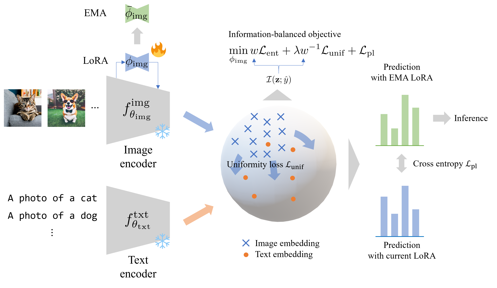

# Uniformity First: Uniformity-aware Test-time Adaptation of Vision-language Models against Image Corruption (TMLR)
The official code for "Uniformity First: Uniformity-aware Test-time Adaptation of Vision-language Models against Image Corruption."  
[[Paper](https://openreview.net/forum?id=YELPe35KIg)] [[arXiv](https://arxiv.org/abs/2505.12912)]

<details><summary><strong>Abstract</strong></summary>
Pre-trained vision-language models, such as contrastive language-image pre-training (CLIP), have demonstrated a remarkable generalizability, enabling a wide range of applications, including zero-shot classification. However, vision-language models still struggle to handle distribution shifts, where input samples have large gaps from training ones. We found that CLIP is especially vulnerable to image corruption, a type of realistic distribution shift caused by sensor conditions such as weather, light, or noise. Collecting a new dataset from a test distribution for fine-tuning is highly costly since image corruption occurs unexpectedly and has a wide variety of types. Thus, we investigate test-time adaptation (TTA) of zero-shot classification, which enables on-the-fly adaptation to the test distribution with unlabeled test data. Existing TTA methods for CLIP mainly focus on modifying image and text embeddings or predictions to address distribution shifts. Although these methods can adapt to domain shifts, such as out-of-distribution or different renditions in input images, they fail to adapt to distribution shifts beyond domain shifts, e.g., image corruption. We found that uniformity of image embeddings, which is related to the amount of information, is a key factor that differentiates domain shifts and other distribution shifts. To enable adaptation to image corruption, we propose a novel method called uniformity-aware information-balanced TTA (UnInfo). To address distribution shifts, we introduce uniformity-aware confidence maximization, information-aware loss balancing, and knowledge distillation from the exponential moving average (EMA) teacher. Through experiments, we demonstrate that our UnInfo improves accuracy under image corruption by retaining information in terms of uniformity.
</details>



## Environment
- Prepare the datasets (ImageNet-C, ImageNet-C-bar) and write their paths in `dataset/dataset_config.py`.
- Install dependencies or build the docker image according to `docker/Dockerfile`.

```bash
$ docker build -t tta_uninfo docker --no-cache
```


## TTA
```bash
$ python3 main.py -c imagenet-c.yaml -o result

# running with the docker image
$ docker run -it --rm -v $(pwd):$(pwd) -w $(pwd) --gpus device=0 tta_unifo python3 main.py -c imagenet-c.yaml -o result
```


## Citation
If our work assists your research, please cite our paper:

```
@article{adachi2026uniformity,
  title={Uniformity First: Uniformity-aware Test-time Adaptation of Vision-language Models against Image Corruption},
  author={Kazuki Adachi and {Shin'ya} Yamaguchi and Tomoki Hamagami},
  journal={Transactions on Machine Learning Research},
  issn={2835-8856},
  year={2026},
  url={https://openreview.net/forum?id=YELPe35KIg}
}
```
